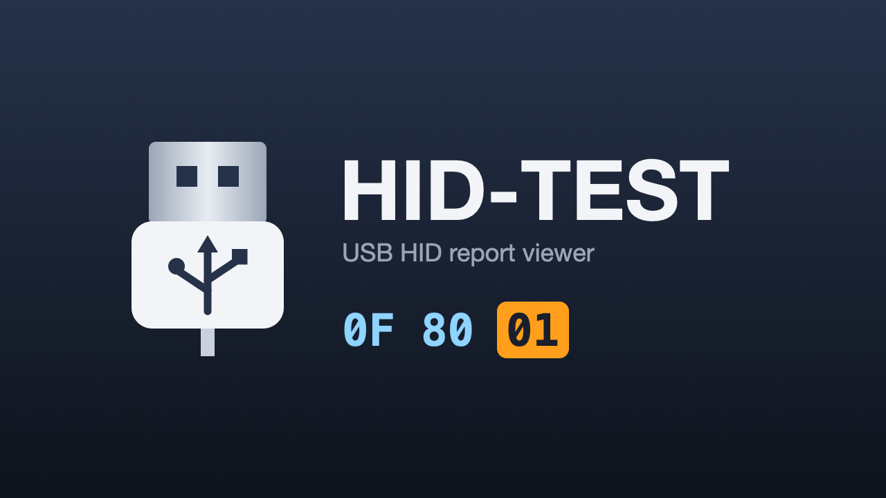

# HID-TEST (Aroma port)

A small tool to view the data that comes from HID devices on the Wii U, for
writing [controller_patcher](https://github.com/Maschell/controller_patcher)
config files.

This branch ports Maschell's original Homebrew Launcher app to
[wut](https://github.com/devkitPro/wut) so it runs as a `.wuhb` under Aroma.

## Usage

Copy `hidtest.wuhb` to `sd:/wiiu/apps/` and start it from the Wii U Menu.

**If the HID to VPAD plugin is installed, disable it first.** It claims attached
HID devices, so HID-TEST can't read them and shows nothing. Hold
**L + D-Pad Down + Minus** on the GamePad to open Aroma's plugin config menu, and
disable it there.

Attach USB HID devices; the app shows the VID, PID, interface details and the
raw report bytes of each one on both the TV and the GamePad.

GamePad controls:
- **Left/Right** (D-Pad): switch between attached devices
- **A**: capture the current report as a baseline. With nothing held on the
  device, press A, then hold a button on it: the app lists each changed byte
  as `0xBYTE,0xMASK=VALUE`, which maps directly onto a controller_patcher
  INI line such as `VPAD_BUTTON_A = 0xBYTE, 0xMASK`
- **+**: exit

Every report that changes is also logged over UDP; run `udplogserver` from
devkitPro's tools on a PC on the same network to see them.

## Building

Requires devkitPro with devkitPPC and wut:

```
make
```

## Credits

- Maschell: original HID-TEST
